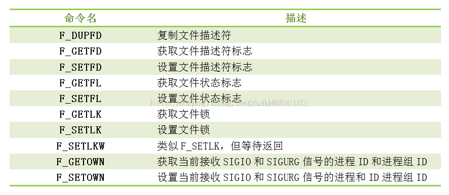

# Linux系统

[TOC]

## 1.进程与线程

## 2.高级I/O函数

​	Linux提供了很多高级IO函数。它们并不像Linux基础IO函数（比如open和read）那么常用（编写内核模块时一般要实现这些IO函数），但在特定条件下却表现出优秀的性能。比如：

1. 用于控制IO行为和属性的函数，包括fcntl函数。
2. 用于创建文件描述符的函数，包括pipe、dup/dup2函数。
3. 用于读写数据的函数，包括readv/writev、sendfile、mmap/munmap、splice和tee函数。

### 2.1 fcntl函数

​	fcntl函数，正如其名字（file control）描述的那样，提供了对文件描述符的各种控制操作。另外一个常见的控制文件描述符属性和行为的系统调用是ioctl，而且ioctl比fcntl能够执行更多的控制。但是，对于控制文件描述符常见的属性和行为，fcntl函数是由POSIX规范指定的首选方法。所以这次只介绍fcntl函数。fcntl函数的定义如下：

```c
#include <fcntl.h>
int fcntl( int fd, int cmd, ... );
```

​	fd参数是被操作的文件描述符，cmd参数指定执行何种类型的操作。根据操作类型的不同，该函数可能不需要第三个可选参数arg。

​	fcntl函数功能依据cmd的值的不同而不同。部分参数对应功能如下：



​	fcntl函数成功时的返回值根据操作类型的不同而不同，失败则返回-1并设置errno。

​	在网络编程中，fcntl函数通常用来将一个文件描述符设置为非阻塞的，代码如下：

```c
int setnonblocking( int fd )
{
    int old_option = fcntl(fd, F_GETFL );		// 获取文件描述符旧的状态标志
    int new_option = old_option | O_NONBLOCK;	// 设置非阻塞标志
    fcntl( fd, F_SETFL, new_option );			
    return old_option;							// 返回文件描述符旧的状态标志，以便日后恢复该状态标志
}
```

​	此外，SIGIO和SIGURG这两个信号与其他Linux信号不同，它们必须与某个文件描述符相关联方可使用：当被关联的文件描述符可读或可写时，系统将触发SIGIO信号；当被关联的文件描述符（而且必须是一个socket）上有带外数据可读时，系统将触发SIGURG信号。将信号和文件描述符关联的方法，就是使用fcntl函数为目标文件描述符宿主进程或进程组，那么被指定的宿主进程或进程组将捕获这两个信号。使用SIGIO时，还需要利用fcntl设置其O_ASYNC标志（异步IO标志，不过SIGIO信号模型并非真正意义上的异步IO模型）。

## 3.I/O多路复用